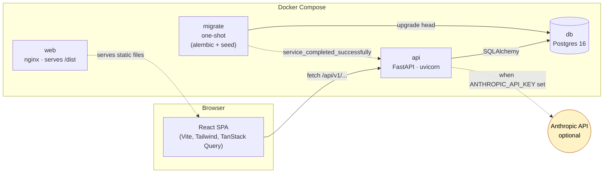
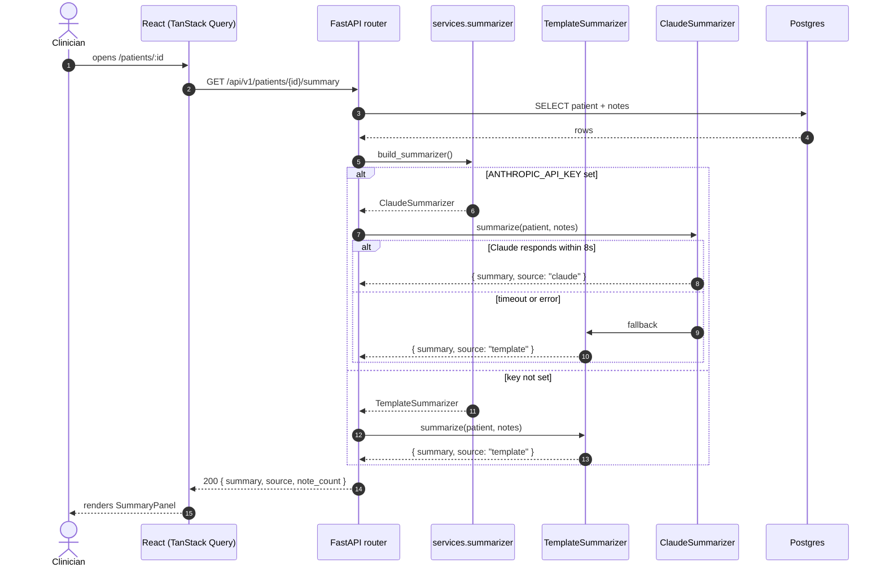

# High-Level Architecture

Two diagrams. The first shows the deployable topology; the second walks one
representative request — `GET /patients/{id}/summary` — through every layer
to illustrate the pluggable summarizer.

---

## 1 · Container diagram

**Key:** solid arrows are runtime requests, dashed arrows are control/setup
dependencies. The Claude edge is dashed because it's only present when an
API key is provisioned (see ADR-0004).

---

## 2 · Sequence: `GET /patients/{id}/summary`

The router never branches on which implementation is active — `Depends`
hands it whichever `Summarizer` was built at startup. The fallback path is
encapsulated *inside* `ClaudeSummarizer`, so callers always see a successful
response (with `source: "template"` if Claude failed).

---

## Layer boundaries

| Layer        | What lives here                                         | Allowed deps                                |
|--------------|---------------------------------------------------------|---------------------------------------------|
| `routers/`   | HTTP shape: paths, params, status codes, dep injection | `services/`, `schemas/`                     |
| `services/`  | Business logic: queries, mutations, summarization      | `models/`, `schemas/`, `db.py`              |
| `models/`    | SQLAlchemy ORM                                          | `db.py`                                     |
| `schemas/`   | Pydantic request/response                               | (none)                                      |
| `seed.py`    | Idempotent fixture data                                 | `models/`, `db.py`                          |

On the frontend:

| Layer                  | What lives here                              |
|------------------------|----------------------------------------------|
| `features/<x>/routes/` | Page components, route-level data fetching   |
| `features/<x>/api.ts`  | Query/mutation hooks for the feature         |
| `features/<x>/components/` | UI components owned by the feature       |
| `features/<x>/schema.ts`   | Zod schemas (forms)                      |
| `components/ui/`           | Shared primitives (Button, Input, Select) |
| `lib/`                     | Cross-cutting helpers (theme, format, API client) |
